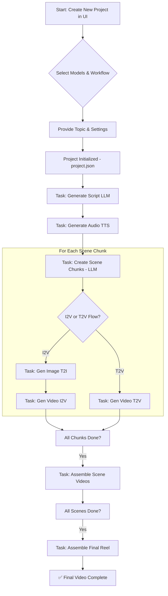

Excellent! The old `README.md` provides valuable context on the project's origins and desired features. I will now merge the strengths of both versions: the feature-rich description from the old `README` and the detailed developer guide from my previous response, all updated to reflect the current Streamlit UI-based architecture.

Here is the revised, comprehensive `README.md` file.

---

# Modular AI Video Generation Pipeline

[](https://www.python.org/)
[](https://streamlit.io)
[](LICENSE)

An extensible, modular pipeline for generating short-form videos using a variety of AI models. This tool provides a powerful Streamlit-based web interface to define a video topic, select different AI models for each generation step (language, speech, image, video), and orchestrate the entire content creation process from script to final rendered video.

  
*(Add a screenshot or GIF of your application here for maximum impact!)*

## Core Features

-   **End-to-End Video Generation**: Go from a single topic idea to a fully edited video with narration, background visuals, and text overlays in one integrated workflow.
-   **Fully Modular Architecture**: Easily add, remove, or swap different AI models for each part of the pipeline. The system is designed for extension.
-   **Dynamic Model Discovery**: The application automatically discovers any new model modules you add, making them immediately available for selection in the UI.
-   **Dual Generation Workflows**:
    -   **Image-to-Video (High Quality)**: Generates a keyframe image first, then animates it. Offers higher visual quality and control.
    -   **Text-to-Video (Fast)**: Generates video clips directly from text prompts for a faster, more streamlined process.
-   **Character Consistency**: Utilizes IP-Adapters in supported models (like Juggernaut-XL) to maintain the appearance of a specific character or subject across different scenes.
-   **Interactive Project Dashboard**: Once a project is created, you have full control. Edit scripts, regenerate audio, modify visual prompts, and see the progress of every task in real-time.
-   **Stateful Project Management**: Stop and resume your work at any time. The entire project state is saved, allowing you to load existing projects, make changes, and continue where you left off.
-   **Multi-Language Voice Generation**: Generate narration in over 15 languages (including English, Spanish, French, German, Japanese, Hindi, and more) using advanced TTS models.
-   **Voice Cloning**: Provide a short `.wav` file of a reference voice to clone it for the video's narration, powered by Coqui XTTS.

## Architectural Overview

The pipeline follows a state-driven, sequential process. The `ProjectManager` tracks the status of every task in a `project.json` file. The `TaskExecutor` then reads this state and executes the next pending task using the specific modules you selected for the project.



## Installation

This project uses `uv` for fast package management.

**1. Prerequisites**
*   Python 3.10 or newer.
*   `git` for cloning the repository.
*   **For GPU acceleration (highly recommended):** NVIDIA GPU with CUDA drivers installed.
*   **FFmpeg**: Required by `moviepy` for video processing. Ensure it's installed and accessible in your system's PATH.
    -   **Ubuntu**: `sudo apt update && sudo apt install ffmpeg`
    -   **macOS (with Homebrew)**: `brew install ffmpeg`
    -   **Windows**: Download from the [official site](https://ffmpeg.org/download.html) and add the `bin` folder to your PATH.

**2. Clone the Repository**
```bash
git clone https://github.com/your-username/your-repo-name.git
cd your-repo-name
```

**3. Set up a Virtual Environment and Install Dependencies**

First, install `uv`:
```bash
pip install uv
```

Next, create a virtual environment and install all required packages using `uv`. This single command installs all dependencies, including PyTorch for your specific CUDA version (or CPU if CUDA is not available).

```bash
# Create a virtual environment
uv venv

# Activate the environment
# On macOS/Linux:
source .venv/bin/activate
# On Windows:
.venv\Scripts\activate

# Install all packages using the provided command
uv pip install torch torchvision torchaudio coqui-tts transformers streamlit sentencepiece moviepy ftfy "huggingface-hub[cli]" hf-transfer accelerate bitsandbytes pydantic --no-build-package llvmlite
```
> **Note:** The `--no-build-package llvmlite` flag is included to prevent `uv` from trying to build the `llvmlite` package from source, which can fail without the proper LLVM toolchain. This forces it to use a pre-compiled wheel.

## Getting Started

With your virtual environment activated, launch the Streamlit app:

```bash
streamlit run app.py
```

Your web browser should automatically open to the application's UI.

### Workflow
1.  **Create a New Project**: On the main page, fill out the "Create New Project" form.
    *   **Generation Flow**: Choose between "Image to Video" (high quality) or "Text to Video" (fast).
    *   **Model Selection**: Select your desired AI models from the dropdowns for each stage.
    *   **Topic**: Enter the subject of your video.
    *   **Settings**: Configure the video format, length, and number of scenes.
    *   **Characters (Optional)**: If you select a model flow that supports character consistency, you can upload reference images for your subjects.
2.  **Processing Dashboard**: After creating the project, you'll be taken to the dashboard.
    *   **Automatic Mode**: Toggle "Automatic Mode" and click "Start" to have the pipeline run through all the steps automatically.
    *   **Manual Control**: With automatic mode off, you can manually trigger each step (e.g., "Gen Audio", "Gen Image"). This is perfect for fine-tuning.
    *   **Edit Everything**: Click into any text box to edit the script narration or visual prompts, then regenerate that specific part.
3.  **Final Assembly**: Once all scenes and clips are generated, a button will appear to assemble the final video. Click it to view the finished product, complete with subtitles and synchronized audio.

---

## ⭐ How to Develop Your Own Module ⭐

The pipeline is designed for easy extension. To add a new AI model, you simply need to create a Python class that inherits from one of the abstract base classes in `base_modules.py` and implements its required methods.

**The Core Contract: `base_modules.py`**

This file defines the interface for every module type:
*   `BaseLLM`: For language models.
*   `BaseTTS`: For text-to-speech models.
*   `BaseT2I`: For text-to-image models.
*   `BaseI2V`: For image-to-video models.
*   `BaseT2V`: For text-to-video models.

### Step-by-Step Guide to Adding a New I2V Model

Let's create a new hypothetical Image-to-Video module called "MotionWeaver".

**1. Create the File**

Create a new file in the appropriate directory: `i2v_modules/i2v_motion_weaver.py`.

**2. Define the `Config` and `Module` Classes**

In your new file, set up the basic structure.

```python
# In i2v_modules/i2v_motion_weaver.py
import torch
from typing import Dict, Any, List, Optional, Union

# Import from the project's own files
from base_modules import BaseI2V, BaseModuleConfig, ModuleCapabilities
from config_manager import DEVICE, clear_vram_globally, ContentConfig

# Step 2a: Define a Pydantic config for your model's parameters.
class MotionWeaverI2VConfig(BaseModuleConfig):
    model_id: str = "some-repo/motion-weaver-pro"
    num_inference_steps: int = 20
    motion_strength: float = 0.9

# Step 2b: Create the main class inheriting from the correct base class.
class MotionWeaverI2V(BaseI2V):
    # Link your config class
    Config = MotionWeaverI2VConfig

    # Implement all required abstract methods...
```

**3. Implement `get_capabilities()`**

This is the most important method for UI integration. It tells the application what your model can do, and this information is used to populate dropdowns and enable/disable features.

```python
# Inside the MotionWeaverI2V class

@classmethod
def get_capabilities(cls) -> ModuleCapabilities:
    """Returns the spec sheet for this module."""
    return ModuleCapabilities(
        # This title appears in the UI dropdown. Be descriptive!
        title="MotionWeaver Pro (Smooth & Cinematic)",
        vram_gb_min=10.0,
        ram_gb_min=16.0,
        supports_ip_adapter=False, # This model doesn't support it
        max_subjects=0,
    )
```

**4. Implement Core Functionality (`generate_video_from_image`)**

This is where you call your model's code. The method signature is strictly defined by `BaseI2V`.

```python
# Inside the MotionWeaverI2V class

def generate_video_from_image(self, image_path: str, output_video_path: str, target_duration: float, content_config: ContentConfig, visual_prompt: str, motion_prompt: Optional[str], ip_adapter_image: Optional[Union[str, List[str]]] = None) -> str:
    # 1. Load the model (if not already loaded)
    self._load_pipeline()

    # 2. Prepare inputs (e.g., load image, calculate frames)
    from diffusers.utils import load_image, export_to_video
    input_image = load_image(image_path)
    num_frames = int(target_duration * content_config.fps)

    # 3. Call the pipeline
    video_frames = self.pipe(
        image=input_image,
        prompt=visual_prompt, # Use the prompts provided by the controller
        motion_prompt=motion_prompt,
        num_frames=num_frames,
        motion_strength=self.config.motion_strength
    ).frames

    # 4. Save the output and return the path
    export_to_video(video_frames, output_video_path, fps=content_config.fps)
    print(f"MotionWeaver video saved to {output_video_path}")
    return output_video_path
```

**5. Implement VRAM Management and Other Helpers**

To manage memory, the pipeline loads and unloads models as needed.

```python
# Inside the MotionWeaverI2V class

def _load_pipeline(self):
    """Loads the model into memory. Should be idempotent."""
    if self.pipe is None:
        from some_library import MotionWeaverPipeline # Local import
        print(f"Loading MotionWeaver pipeline: {self.config.model_id}...")
        self.pipe = MotionWeaverPipeline.from_pretrained(
            self.config.model_id, torch_dtype=torch.float16
        ).to(DEVICE)

def clear_vram(self):
    """Releases the model from VRAM."""
    print("Clearing MotionWeaver VRAM...")
    if self.pipe is not None:
        clear_vram_globally(self.pipe) # Use the global helper
    self.pipe = None

def get_model_capabilities(self) -> Dict[str, Any]:
    """Return technical details about the model."""
    return {
        "resolutions": {"Portrait": (512, 768), "Landscape": (768, 512)},
        "max_chunk_duration": 4.0 # Max video length it can generate at once
    }
```

**6. Register the Module**

Finally, open the `__init__.py` file in the same directory (`i2v_modules/__init__.py`) and add an import for your new class. This makes it discoverable.

```python
# In i2v_modules/__init__.py

from .i2v_ltx import LtxI2V
from .i2v_svd import SvdI2V
from .i2v_slideshow import SlideshowI2V
from .i2v_motion_weaver import MotionWeaverI2V # <-- Add this line
```

**That's it!** The next time you run `streamlit run app.py`, "MotionWeaver Pro (Smooth & Cinematic)" will appear as an option in the Image-to-Video Model dropdown.

## Directory Structure
```
.
├── app.py                      # Main Streamlit web application
├── base_modules.py             # Abstract base classes for all modules (The Contract)
├── config_manager.py           # Pydantic configs and global settings
├── module_discovery.py         # Service to automatically find and load modules
├── project_manager.py          # Handles loading, saving, and managing project state
├── task_executor.py            # Orchestrates the execution of generation tasks
├── ui_task_executor.py         # Bridges the UI with the task executor
├── utils.py                    # Shared utility functions
├── video_assembly.py           # Functions for combining clips into the final video
├── llm_modules/                # Language model modules
│   ├── __init__.py
│   └── llm_zephyr.py
├── tts_modules/                # Text-to-Speech modules
├── t2i_modules/                # Text-to-Image modules
├── i2v_modules/                # Image-to-Video modules
└── t2v_modules/                # Text-to-Video modules
```

## License

This project is licensed under the MIT License - see the LICENSE file for details.

### Important Notice Regarding Model Licenses

While this project itself is MIT-licensed, the AI models used within this pipeline (including but not limited to language models, text-to-speech models, image generation models, and video generation models) are subject to their own respective licenses. Users of this project are responsible for:

1. Reviewing and complying with the license terms of each model they choose to use
2. Ensuring they have the necessary rights and permissions to use these models
3. Understanding that different models may have different usage restrictions, commercial terms, and attribution requirements

The MIT license of this project does not override or modify the license terms of any third-party models. Users must independently verify and comply with all applicable model licenses before use.